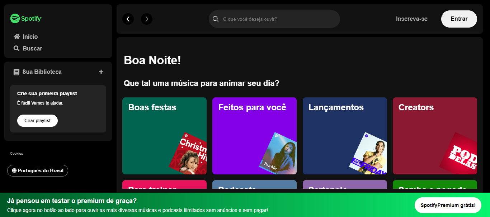

<h1 align="center"> Spotify Clone </h1>

Este projeto foi desenvolvido na imersão Front-End 2024 da Alura . Tem como objetivo ser uma réplica (com alguns ajustes) do site do spotify!  

  <a href="#-tecnologias">Tecnologias</a>&nbsp;&nbsp;&nbsp;|&nbsp;&nbsp;&nbsp;
  <a href="#-projeto">Projeto</a>&nbsp;&nbsp;&nbsp;|&nbsp;&nbsp;&nbsp;
  <a href="#-layout">Layout</a>&nbsp;&nbsp;&nbsp;|&nbsp;&nbsp;&nbsp;
  <a href="#memo-licença">Licença</a>

  

## 🚀 Tecnologias

Esse projeto foi desenvolvido com as seguintes tecnologias:

- HTML e CSS
- JavaScript
- Git e Github
- Figma

## 💻 Projeto

O projeto é um clone do spotify, em que além de replicar a interface gráfica do site, é possível também pesquisar artistas. 

- [Visite o projeto online](https://lelerudeli.github.io/Spotify-ImersaoAlura/)

## 🔖 Layout

Aqui está uma preview do design esperado. 

  

## :memo: Licença

Esse projeto está sob a licença MIT.

---
 

 Feito por Letícia Rudeli ♥ 

